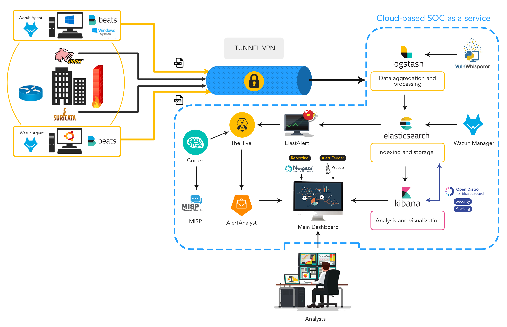
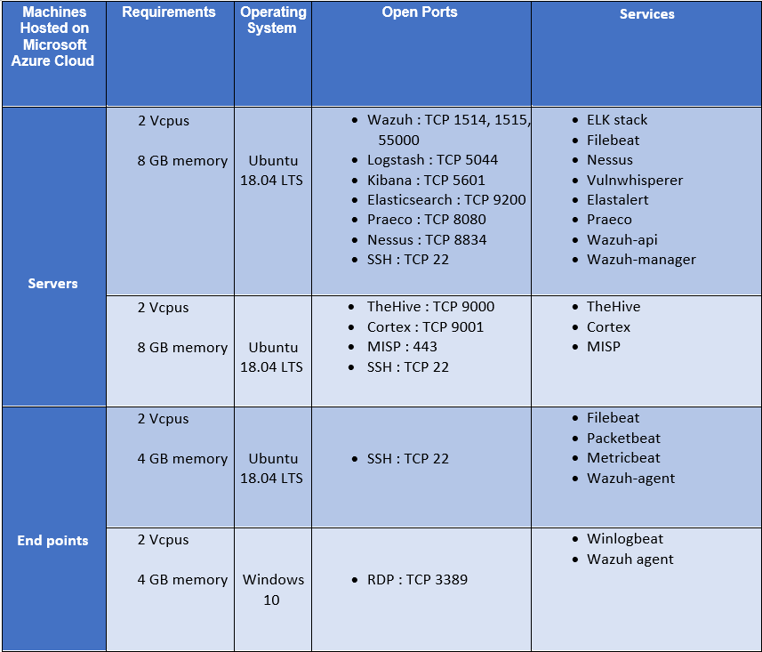

# OpenSource-SocasS
# Deploying of infrastructure and technologies for a SOC as a Service ( SOCasS) 

In the last couple of years, the number of cyberattacks have gone throw the roof. These attacks not only target single individuals but also firms, government infrastructure, etc. Passive solution like antivirus, firewall, NIDS and NIPS are becoming more and more insufficient due to the sophistication of attacks and their massive quantity. 
One of the common solutions is for the entity to have a SIEM (Security incident event management) it helps understand what is happening in the environment by collecting alerts and logs generated by network and data security devices. However, the downside is that you need experts to analyze these alerts, do the investigation which can cost time and money. 

  

This leads to the approach of the Security Operation Center also known as SOC is considered the new approach in the world of cyber-security to mitigate against the increasing number of attacks in quantity and level of complexity and sophistication. A SOC is a centralized unit comprised of skilled people, processes, and technologies working together to deliver end-to-end security capabilities. These include the prevention, detection, and investigation of and response to, cybersecurity threats and incidents. But this solution is the privilege of only Big Firms due to the expensive cost of the SOC team.  

This is where the approach of the Security Operation Center as a Service comes into place. SOCaaS is outsourcing the security operations center by a third party. This will enable organizations who lack the resources to improve their security posture and provide enhanced visibility of their cyber risk at a cheaper price, excellent efficiency and a faster deployment time 

**This is an end year project realized by three students from the faculty of INSAT Tunisia. Ibrahim Ayadhi(Me), Ghassen Miled and Mehdi Masri, under the supervision of Prof. Bassem Ben Salah. The technologies and tools that were used are 100% free and open source** 

In recognition of the open source communities and their help in making this project come true. We have decided to publish our documentation and the steps we took into creating this project for the public. 

## Detailed architecture diagram of our solution: 

This solution allows for log retention, analysis, monitoring, alert generation, generation of reports, IoC enrichment and incident response management. 

In the figure above, we collect all the different types of data from hosts, network components. Then they are sent to Logstash via a secure channel (VPN tunnel). We have used ELK beats and Wazuh-agent for the collection of data and logs and send them to the ELK SIEM. 

After data aggregation and processing by Logstash. Elasticsearch will handle the indexing of data to optimize the storage process and the data search. Data is then forwarded to Kibana which will take care of the Analysis and visualization of the stored data. 

In the same time, the Wazuh HIDS agent sends data back to the Wazuh Manager and Elasticsearch. 
From there, ElastAlert will watch for new events of interest and generate alerts inside TheHive. 
A workflow will then enrich the case with additional queries from the Cortex analyzers and MISP, resulting in either an automatic closure of the case or an escalation to an analyst. Alerts are available for Analysts to claim and trigger enrichment through Cortex and MISP. 

From there, ElastAlert will watch for new events of interest and generate alerts inside TheHive.
A workflow will then enrich the case with additional queries from the Cortex analyzers and MISP, resulting in either an automatic closure of the case or an escalation to an analyst.
Alerts are available for Analysts to claim and trigger enrichment through Cortex and MISP.

## Hardware and software components used in this deployment:
### Hardware components:
This table represents the overall infrastructure, requirements and services deployed in our project.
Besides it can be deployed in larger environments with the right configurations and scalable infrastructure.
For end points, it is possible to connect any device generating logs with the server machine (e.g. : routers , switches , etc. .. )

### Disclaimer :
- The endpoint devices shown in the diagram were not all implemented in this project due to the lack of resources and material. We won’t cover firewalls, routers.

- The hardware that we have chosen for this project aren’t suited for production. It is recommended to spend more on the hardware. We would recommend 8 Vcpu for each server, 32GB of RAM for the first server and 8GB for the second one.

### Software components:
- ELK stack : The ELK stack is an acronym used to describe a stack that comprises of three popular open-source projects: Elasticsearch, Logstash, and Kibana. Often referred to as Elasticsearch, the ELK stack gives you the ability to aggregate logs from all your systems and applications, analyze these logs, and create visualizations for application and infrastructure monitoring, faster troubleshooting, security analytics, and more.

- Beats : are lightweight data shippers, that you install on your servers to capture all sorts of operational data (think of logs, metrics, or network packet data). The Beats send the operational data to Elasticsearch, either directly or via Logstash, so it can be visualized with Kibana.

- Elastalert : is a simple framework for alerting on anomalies, spikes, or other patterns of interest from data in Elasticsearch. It works by combining Elasticsearch with two types of components, rule types and alerts. Elasticsearch is periodically queried and the data is passed to the rule type, which determines when a match is found. When a match occurs, it is given to one or more alerts, which act based on the match.

- Suricata : is an open source threat detection engine that was developed by the Open Information Security Foundation (OISF). Suricata can act as an intrusion detection system (IDS), and intrusion prevention system (IPS), or be used for network security monitoring.

- Open Distro for Elasticsearch :
  -Alerting feature : it provides a powerful, easy-to-use event monitoring and alerting system, enabling you to monitor your data and send notifications automatically to your stakeholders. With an intuitive Kibana interface and powerful API, it is easy to set up and manage alerts.
  
  -Security feature : it includes a number of authentication options (such as Active Directory and OpenID), encryption in-flight, fine-grained access control, detailed audit logging, advanced compliance features, and more.
  
- Praeco: is an alerting tool for Elasticsearch — a GUI for ElastAlert, using the ElastAlert API. With Praeco you can Interactively build alerts for your Elasticsearch data using a query builder , send notifications to Slack, Email, Telegram or an HTTP POST endpoint , in addition to many other features provided by this tool.

- Wazuh : is a free and open source platform for threat detection, security monitoring, incident response and regulatory compliance. It can be used to monitor endpoints, cloud services and containers, and to aggregate and analyze data from external sources. Wazuh agents scan the monitored systems looking for malware, rootkits and suspicious anomalies. They can detect hidden files, cloaked processes or unregistered network listeners, as well as inconsistencies in system call responses.

- Nessus Essentials : is a free vulnerability scanner that provides an entry point for vulnerability assessment. It allows you to scan your environment with the same high-speed, in-depth assessments and agentless scanning convenience.

- TheHive: TheHive describes itself as “A scalable, open source and free Security Incident Response Platform designed to make life easier for any information security practitioner dealing with security incidents that need to be investigated and acted upon swiftly”.In essence it’s an alert management platform for managing an incident alert from creation to closure.

- Cortex: Cortex is another software product from the same team as TheHive and complements that product with data enrichment. Cortex allows the use of “analyzers” to gain additional information on the indicators already present in your logs. It allows the querying of third-party services on indicators such as IP, URL, and file hash, and will tag the alert with this additional information. No need to send a file hash manually to VirusTotal when an analyzer will automatically do it for you and tag the alert with the results.

- MISP : The Malware Information and Sharing Platform (MISP) is a threat intelligence platform for sharing, storing and correlating Indicators of Compromise of targeted attacks, threat intelligence, financial fraud information, etc. MISP is used today in multiple organizations to store, share knowledge, collaborate on cyber security indicators, malware analysis In order to insure a better security protection.

This first article was meant as an introduction to our work. Details will be provided in the upcoming articles and this is the planning that we will be following :

1- ELK stack: Installation and shipping data

2- A walk-through open Distro.

3-Vizualizing Dashboards and ELK SIEM

4-WAZUH integration

5-Alerting

6- Reporting

7-Case Management

8- Test Cases
